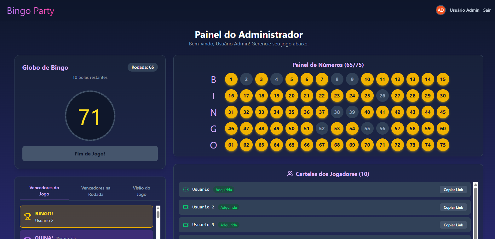
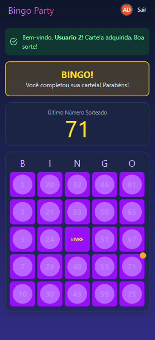
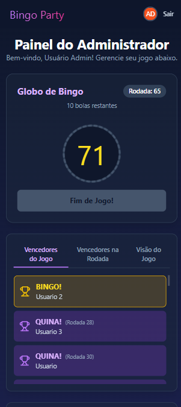

# Bingo Party Manager  bingo_party

Bem-vindo ao **Bingo Party Manager**! Um aplicativo web moderno e interativo para criar e gerenciar jogos de bingo de forma fácil e divertida. Perfeito para festas, encontros familiares ou eventos com amigos.

Este aplicativo foi projetado com uma abordagem "mobile-first", garantindo uma experiência perfeita em qualquer dispositivo. O administrador do jogo tem um painel de controle completo, enquanto os jogadores podem entrar na partida com um simples link, sem a necessidade de downloads ou instalações.

---

## ✨ Funcionalidades Principais

### Painel do Administrador
- **Criação de Jogos Personalizada:** Configure o tamanho das cartelas (5x5, etc.) e o número de cartelas a serem geradas.
- **Globo de Bingo Virtual:** Sorteie números um a um com um clique. O globo mostra o último número sorteado e quantas bolas ainda restam.
- **Painel de Números Completo:** Visualize todos os números do jogo, organizados por colunas (B-I-N-G-O), com os números já sorteados claramente destacados.
- **Gerenciamento de Jogadores:** Gere e compartilhe links exclusivos para cada cartela. Acompanhe quais cartelas já foram adquiridas pelos jogadores.
- **Monitoramento de Vencedores:** Um sistema de abas exibe os vencedores do jogo (Bingo e Quinas), os vencedores da rodada atual e uma visão geral estratégica de quais jogadores estão mais perto de ganhar.
- **Responsividade:** O layout se adapta de forma inteligente para oferecer a melhor visualização tanto em telas grandes quanto em dispositivos móveis.

### Página do Jogador
- **Acesso Fácil:** Jogadores entram no jogo através de um link exclusivo, sem necessidade de cadastro.
- **Aquisição de Cartela:** Antes de ver os números, o jogador "adquire" a cartela inserindo seu nome, aumentando o suspense.
- **Marcação Automática:** Os números sorteados são marcados automaticamente na cartela do jogador em tempo real.
- **Alertas de Vitória:** Pop-ups comemorativos e animados aparecem quando um jogador faz uma "Quina" (linha completa) ou "Bingo".
- **Estatísticas em Tempo Real:** O jogador pode acompanhar quantas pedras faltam para completar a cartela e um detalhamento das "Quinas" já feitas (horizontal, vertical e diagonal).

---

## 📸 Screenshots do Jogo

Adicione aqui as imagens do seu aplicativo para demonstrar suas funcionalidades.

### **Painel do Administrador (Desktop)**
*(Substitua este texto pela sua imagem. Ex: )*

 

### **Página do Jogador com Cartela**
*(Substitua este texto pela sua imagem. Ex: )*

 

### **Alerta de "Bingo!"**
*(Substitua este texto pela sua imagem. Ex: )*

### **Alerta de "Bingo - Mobile!"**
*(Substitua este texto pela sua imagem. Ex: )*

 

### **Visualização em Dispositivo Móvel**
*(Substitua este texto pela sua imagem. Ex: )*

---

## 🛠️ Tecnologias Utilizadas

- **Frontend:** React com TypeScript
- **Estilização:** Tailwind CSS para um design rápido, moderno e responsivo.
- **Estado do Jogo:** A aplicação simula um backend em tempo real utilizando o `localStorage` do navegador para persistir o estado do jogo, permitindo que a sessão seja retomada mesmo que a página seja recarregada.

Este projeto foi construído para ser autocontido e funcionar diretamente no navegador, sem a necessidade de um backend complexo ou banco de dados.